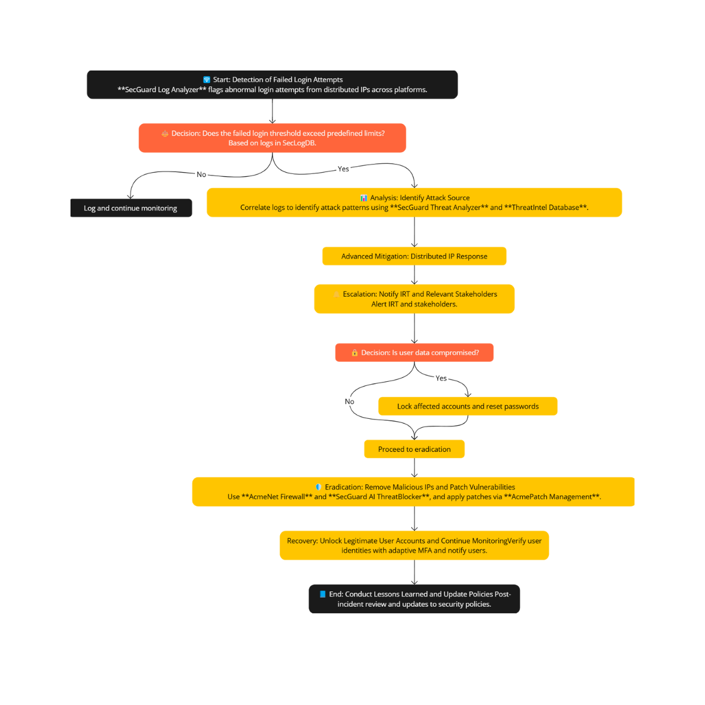

# Brute-Force-Attack-Playbook
This playbook outlines the step-by-step process for detecting, mitigating, and responding to brute force attacks targeting Acme’s mobile banking application.
It incorporates Acme-specific configurations, such as customized authentication mechanisms, integration with proprietary monitoring tools, and enforcement of access control measures unique to Acme’s infrastructure. 
**NOTE** that Acme is a not a real company and it was created just for the sake of this project.

### Scope
This playbook applies to all brute force attack incidents targeting Acme’s systems, including but not limited to:
- Customer login portals.
- Administrative panels.
- APIs.
- Backend authentication mechanisms.

